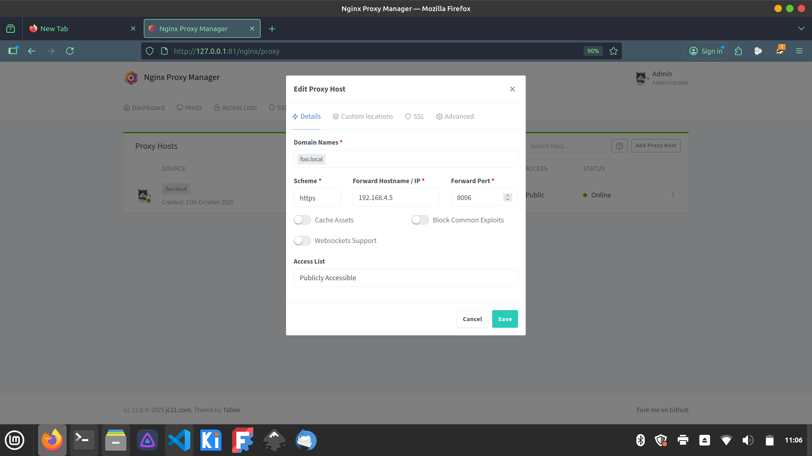

# VHS Tool Auth service

This is a small service that allows VHS to use nginx reverse proxies to authenticate users, allowing access to internal tools like our laser cutter and our 3d printers.

How it works:

1. a tool sits behind an nginx reverse proxy, something like a raspberri pi running klipper/mainsail and connected to one or more 3d printers.
2. nginx uses a short lua script to check requests headed for the tool for a valid JWT cookie
3. if the cookie isn't present, nginx redirects the request to `/login` which is proxied to this service. It tags these requests with the X-Permission header to select which permission we're checking for.
4. the `/login` endpoint presents a login page, takes the user's username and password, and uses it to login to nomos and check the user's permissions for access to this particular tool.
5. if the user has permission to use this tool, they are issued a JWT cookie that's valid for 1 day, and re-directed to the tool's main page

The tool is secured by configuring it to deny requests from anything but the proxy server.

THe nginx configuration is stored in `nginx.conf`, this needs to be added to a proxy set up in nginx proxy manager.

# Deployment

- This is deployed on a proxmox lxc container on premise at VHS.
- It's kept running by pm2
- It's updated periodically by polling this repo using the `poll.sh` script
- Polling is managed by a crontab entry

## Re-creating the deployment container:

- Create an alpine container on proxmox: `bash -c "$(curl -fsSL https://raw.githubusercontent.com/community-scripts/ProxmoxVE/main/ct/alpine.sh)"` [Proxmox VE Helper-Scripts](https://community-scripts.github.io/ProxmoxVE/scripts?id=alpine&category=Operating+Systems)
- Inside the container
    - Install git, nodejs: `apk add git nodejs`
    - add alpine community repo: `echo "http://dl-cdn.alpinelinux.org/alpine/edge/community" >> /etc/apk/repositories`
    - Install yarn: `apk add yarn`
    - Install pm2 globally `yarn global add pm2`
    - Persist pm2, so it starts on boot: `pm2 startup`
    - Clone this repo: `git clone git@github.com:coryalder/vhs-tool-auth.git`
    - Start the app using pm2: `pm2 start app.pm2.json`
    - Add the poll script to crontab: `vim /etc/crontab` -> copy the crontab line from the top of `/poll.sh` 

## Cheatsheet

- Restart the service: `pm2 delete vhs-tool-auth && pm2 start app.pm2.json && pm2 save`
- Pull the latest version of the repo: `./poll.sh`

# Security

This whole setup depends on one thing: that you cannot access the tool server (raspberry pi, etc) directly over the network - ONLY through the proxy. If that isn't true, you can just bypass this whole business by typing in the ip of the tool server.

Now, VHS isn't a super hostile environment, and generally people behave well and don't try to bypass tool lockouts - but an open door is an invitation, so let's keep the door closed.

Another security concern is usernames and passwords. This service takes in member credentials to authenticate with nomos. They aren't stored anywhere, or logged anywhere, and they only exist in-memory for a few seconds while we query membership.vanhack.ca, then the service immediately forgets them. Because of that, access to this service should ideally be via SSL. Otherwise it may be trivial to sniff network traffic and get members usernames and passwords, depending on our wifi config, and other network settings. Communication between this service and nomos is all via ssl, so should be safe.
